<h2>TensorFlow-FlexUNet-Image-Segmentation-Breast-Cancer-Ultrasound-Preprocessed (2026/06/25)</h2>
Sarah T. Arai 
Software Laboratory antillia.com  
This is the first experiment of Image Segmentation for <b>Breast Cancer Ultrasound Preprocessed</b> based on our 
<a href="https://github.com/sarah-antillia/TensorFlow-FlexUNet-Image-Segmentation-Model">TensorFlow-FlexUNet-Image-Segmentation-Model</a> 
(TensorFlow Flexible UNet Image Segmentation Model for Multiclass), 
and a 512x512 pixels PNG 
<a href="https://drive.google.com/file/d/1MEHEQ46jKuUwo1O8hW4ihQtbdJYQai7c/view?usp=sharing">
<b>Augmented-Breast-Cancer-Preprocessed-ImageMask-Dataset.zip</b></a> with colorized masks 
(<a href="https://creativecommons.org/publicdomain/zero/1.0/">CC0: Public Domain</a>)
, which was derived by us from   
<a href="https://www.kaggle.com/datasets/sayedmeeralishah/breast-cancer-segmentation-dataset-preprocessed">
<b>Breast Cancer Segmentation Dataset (Preprocessed)
</b></a> by sayed Meer Ali Shah.
  

<b>Actual Image Segmentation for Breast-Cancer-Preprocessed Images of 512x512 pixels </b> 
As shown below, the inferred masks predicted by our segmentation model trained by the dataset appear similar to the ground truth masks.
  
<table >
<tr>
<th>Input: image</th>
<th>Mask (ground_truth)</th>
<th>Prediction:inferred_mask</th>
</tr>
<tr>
<td>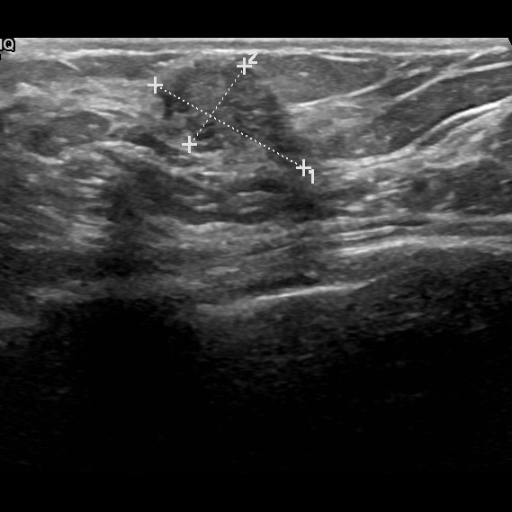</td>
<td></td>
<td></td>
</tr>

<tr>
<td>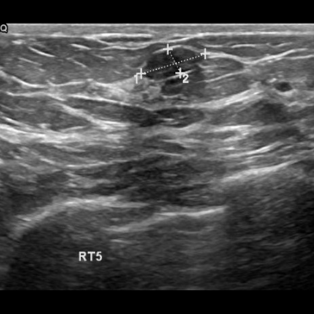</td>
<td>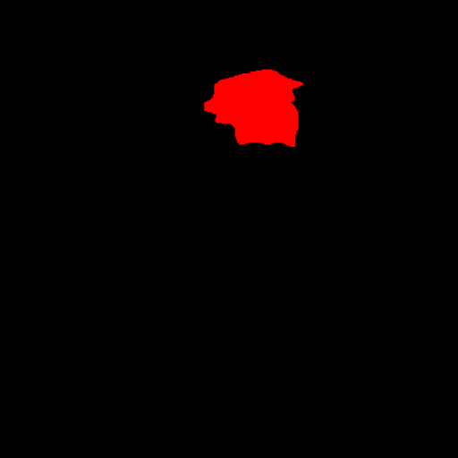</td>
<td></td>
</tr>

<tr>
<td>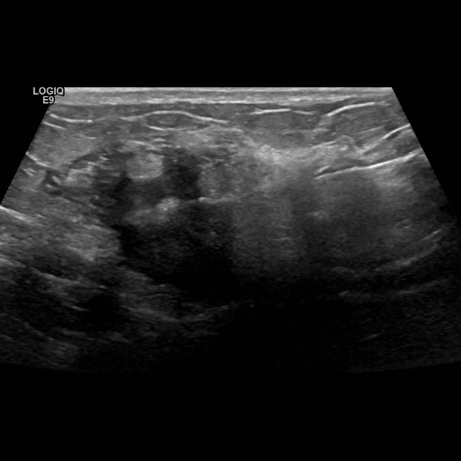</td>
<td>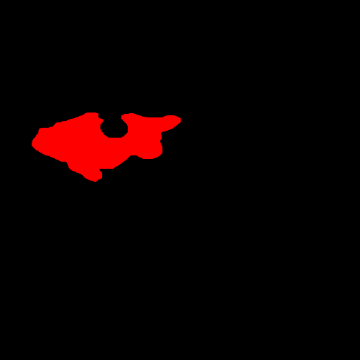</td>
<td></td>
</tr>
 
</table>

 
<h3>1  Dataset Citation</h3>
The dataset used here was derived from   
<a href="https://www.kaggle.com/datasets/sayedmeeralishah/breast-cancer-segmentation-dataset-preprocessed">
<b>Breast Cancer Segmentation Dataset (Preprocessed)
</b></a> by sayed Meer Ali Shah.
 
 
The following explanation was taken from the above web site.  
<b>About Dataset</b> 
<b>Overview</b> 
Breast cancer is one of the leading causes of death among women worldwide. Early detection plays a crucial role i
n reducing mortality rates. In this project, we worked with breast ultrasound images to support early 
detection by applying machine learning techniques for classification, detection, and segmentation.
  
You will find a similar dataset on Kaggle, but not preprocessed.
The Breast Ultrasound Dataset used here is categorized into three classes: normal, benign, and malignant images. 
This dataset was collected in 2018 and includes ultrasound scans of women aged 25 to 75 years. 
It contains 2246 images with an average resolution of 500×500 pixels, all in PNG format. 
Alongside each image, there is a corresponding ground truth mask image.
  
<b>Data Preparation</b> 
When I first reviewed the dataset, I noticed a couple of key issues: 
The dataset was not preprocessed. 
There was a class imbalance problem: 
Benign: 874 images (with their masks) 
Malignant: 420 images 
Normal: 266 images 
 
To address this, I performed data augmentation on the minority classes. After augmentation: 
Malignant images increased to 840 
Normal images increased to 532 
 
Another issue I encountered was that some breast ultrasound images had multiple mask images associated with them. 
To fix this, I merged those masks into a single mask per image. 
 
Lastly, I renamed all the images and masks so that each original image pairs clearly with its corresponding mask. 
This made it much easier to manage the dataset and split it properly for training, validation, and testing.
  
<b>License</b> 
<a href="https://creativecommons.org/publicdomain/zero/1.0/">
CC0: Public Domain
</a>
 
 
<h3>
2 Breast-Cancer-Preprocessed ImageMask Dataset
</h3>
<h3>
2.1 Download ImageMask Dataset
</h3>
 If you would like to train this Breast-Cancer-Preprocessed Segmentation model by yourself,
please down load our dataset <a href="https://drive.google.com/file/d/1MEHEQ46jKuUwo1O8hW4ihQtbdJYQai7c/view?usp=sharing">
<b>Augmented-Breast-Cancer-Preprocessed-ImageMask-Dataset.zip</b> 
</a>(<a href="https://creativecommons.org/licenses/by/4.0/">CC BY 4.0</a>) 
 on the google drive,
expand the downloaded, and put it under <b>./dataset/</b> to be:
<pre>
./dataset
└─Breast-Cancer-Preprocessed
    ├─test
    │   ├─images
    │   └─masks
    ├─train
    │   ├─images
    │   └─masks
    └─valid
        ├─images
        └─masks
</pre>
 
<b>Breast-Cancer-Preprocessed Statistics</b> 
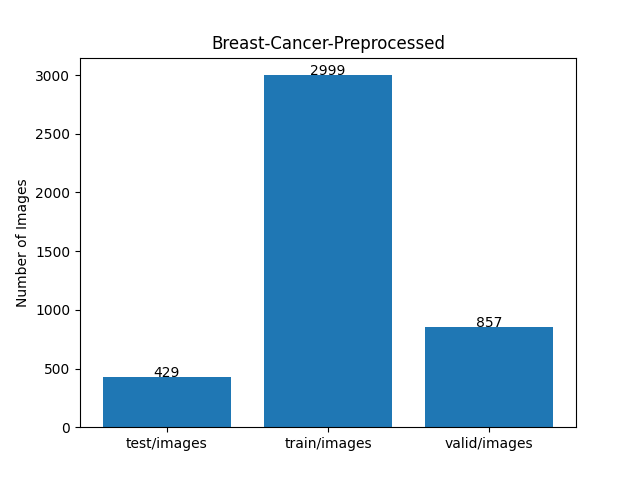 
 
As shown above, the number of images of train and valid datasets is large enough to use for a training set of our segmentation model.
  
<h3>
2.2 Derivation of Breast-Cancer-Preprocessed ImageMask Dataset
</h3>
The folder structure of the orignla <b>Breast-canser_preprocessed dataset</b> dataset is the following 
<pre>
./Breast-canser_preprocessed dataset
  ├─benign
  │   ├─benign (1).png
  │   ├─benign (1)_mask.png
...
  │   ├─benign (437).png
  │   └─benign (437)_mask.png
  │  
  ├─malignant
  │   ├─malignant (1).png
  │   ├─malignant (1)_mask.png
...
  │   ├─malignant (420).png
  │   └─malignant (420)_mask.png
  │   
  └─normal
        ├─normal (1).png
        ├─normal (1)_mask.png
...
        ├─normal (266).png
        └─normal (266)_mask.png
</pre>
<b>Step 1</b> 
We generated a 512x512 pixels cropped master ImageMask Dataset with colorized masks(<b>Benign:green, Malignat:red</b>)
from all pair of images and masks in <b>benign</b> and <b>malignat</b> folders. 
  
<b>Step 2</b> 
We generated our Augmented-Breast-Cancer-Preprocessed from the master ImageMask Dataset 
by using the following image deformation and distortion tools. 
<a href="https://github.com/sarah-antillia/Image-Deformation-Tool">Image-Deformation-Tool</a> 
<a href="https://github.com/sarah-antillia/Image-Distortion-Tool">Image-Distortion-Tool</a> 
 
<h3>
2.3 Train Sample Images and Masks
</h3>
<b>Train sample images</b> 
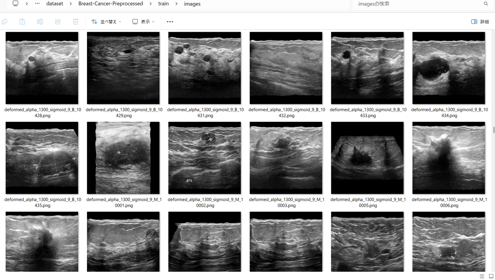
 
<b>Train sample masks</b> 
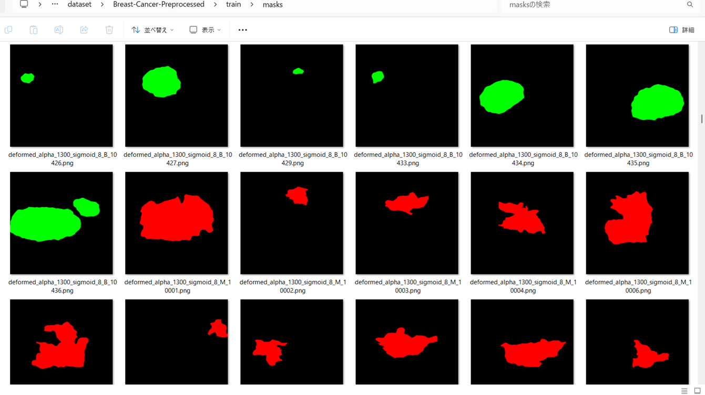
 
<h3>
3 Train TensorflowFlexUNet Model
</h3>
 We trained Breast-Cancer-Preprocessed TensorFlowFlexUNet Model by using the 
<a href="./projects/TensorFlowFlexUNet/Breast-Cancer-Preprocessed/train_eval_infer.config"> <b>train_eval_infer.config</b></a> file.  
Please move to ./projects/TensorFlowFlexUNet/Breast-Cancer-Preprocessed and run the following bat file. 
<pre>
>1.train.bat
</pre>
, which simply runs the following command. 
<pre>
>python ../../../src/TensorFlowFlexUNetTrainer.py ./train_eval_infer.config
</pre>

<b>Model parameters</b> 
Defined a small <b>base_filters=16</b> and a large <b>base_kernels=(11,11)</b> for the first Conv Layer of Encoder Block of 
<a href="./src/TensorFlowFlexUNet.py">TensorFlowFlexUNet.py</a> 
and a large <b>num_layers=8</b> (including a bridge between Encoder and Decoder Blocks).
<pre>
[model]
image_width    = 512
image_height   = 512
image_channels = 3
input_normalize = True
normalization  = False
num_classes    = 3
base_filters   = 16
base_kernels  = (11,11)
num_layers    = 8
dropout_rate   = 0.05
dilation       = (1,1)
</pre>
<b>Learning rate</b> 
Defined a small learning rate.  
<pre>
[model]
learning_rate  = 0.0001
</pre>
<b>Loss and metrics functions</b> 
Specified "categorical_crossentropy" and "dice_coef_multiclass". 
<pre>
[model]
loss           = "categorical_crossentropy"
metrics        = ["dice_coef_multiclass"]
</pre>
<b >Learning rate reducer callback</b> 
Enabled learing_rate_reducer callback, and a small reducer_patience.
<pre> 
[train]
learning_rate_reducer = True
reducer_factor     = 0.4
reducer_patience   = 4
</pre>
<b>Early stopping callback</b> 
Enabled early stopping callback with patience=10 parameter.
<pre>
[train]
patience      = 10
</pre>
<b>Infer section</b> 
<pre>
[infer] 
images_dir    = "./mini_test/images/"
output_dir    = "./mini_test_output/"
</pre>
<b>RGB color map</b> 
rgb color map dict for Breast-Cancer-Preprocessed 1+2 classes. 
<pre>
[mask]
mask_file_format = ".png"
;Breast-Cancer-Preprocessed 1+2
;                      Benign:green,  Malignant:red
rgb_map {(0, 0, 0): 0, (0, 255, 0):1, (255,0,0):2}
</pre>
<b>Epoch change inference callbacks</b> 
Enabled epoch_change_infer callback. 
<pre>
[train]
epoch_change_infer     = True
epoch_change_infer_dir =  "./epoch_change_infer"
epoch_change_infer     = False
epoch_change_infer_dir =  "./epoch_change_infer"
num_infer_images =  6
</pre>
By using this <b>epoch_change_infer</b> callback, on every epoch_change, the <b>infer</b> method of the 
<a href="./src/TensorFlowFlexModel.py">TensorFlowFlexModel</a> class 
can be called
 for 6 images in <b>mini_test</b> folder specified in <b>tiledinfer</b> section. This will help you confirm how the predicted mask changes 
 at each epoch during your training process.    
<b>Epoch_change_inference output at starting (1,2,3)</b> 
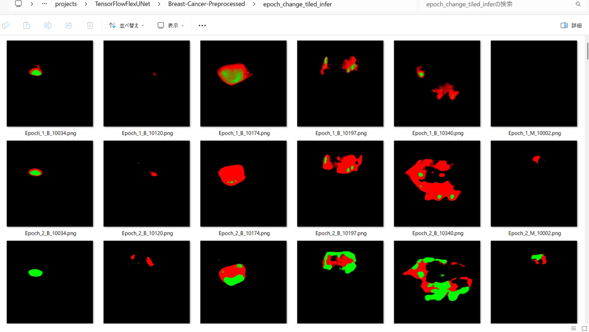 
 
<b>Epoch_change_inference output at ending (23,24,25)</b> 
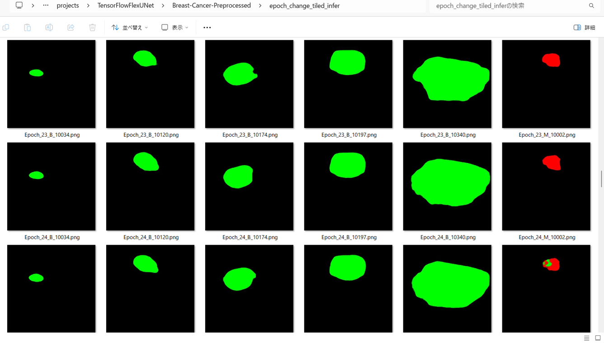 
 
<b>Epoch_change_inference output at ending (48,49,50)</b> 
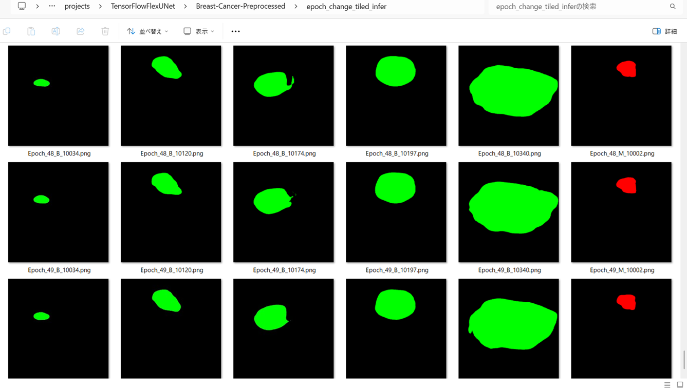 
 
In this experiment, the training process was stopped at epoch 50 by EarlyStoppingCallback.  
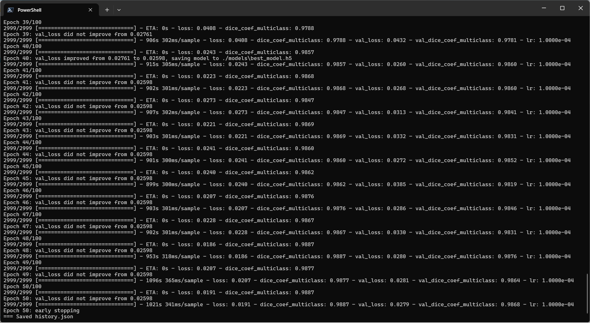 
 
<a href="./projects/TensorFlowFlexUNet/Breast-Cancer-Preprocessed/eval/train_metrics.csv">train_metrics.csv</a> 
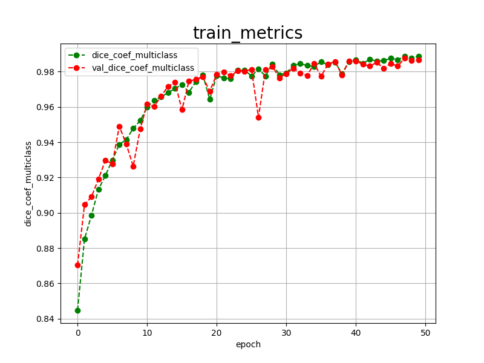 
 
<a href="./projects/TensorFlowFlexUNet/Breast-Cancer-Preprocessed/eval/train_losses.csv">train_losses.csv</a> 
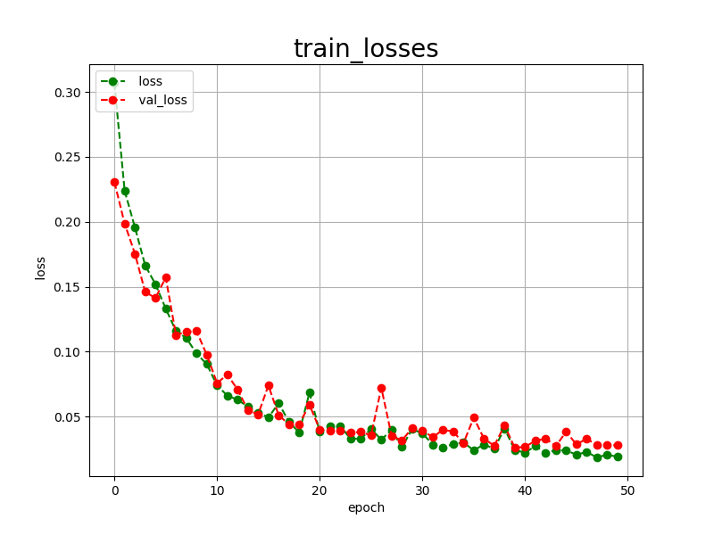 
 
<h3>
4 Evaluation
</h3>
Please move to a <b>./projects/TensorFlowFlexUNet/Breast-Cancer-Preprocessed</b> folder, 
and run the following bat file to evaluate TensorflowFlexUNet model for Breast-Cancer-Preprocessed. 
<pre>
>./2.evaluate.bat
</pre>
This bat file simply runs the following command.
<pre>
>python ../../../src/TensorFlowFlexUNetEvaluator.py  ./train_eval_infer.config
</pre>
Evaluation console output: 
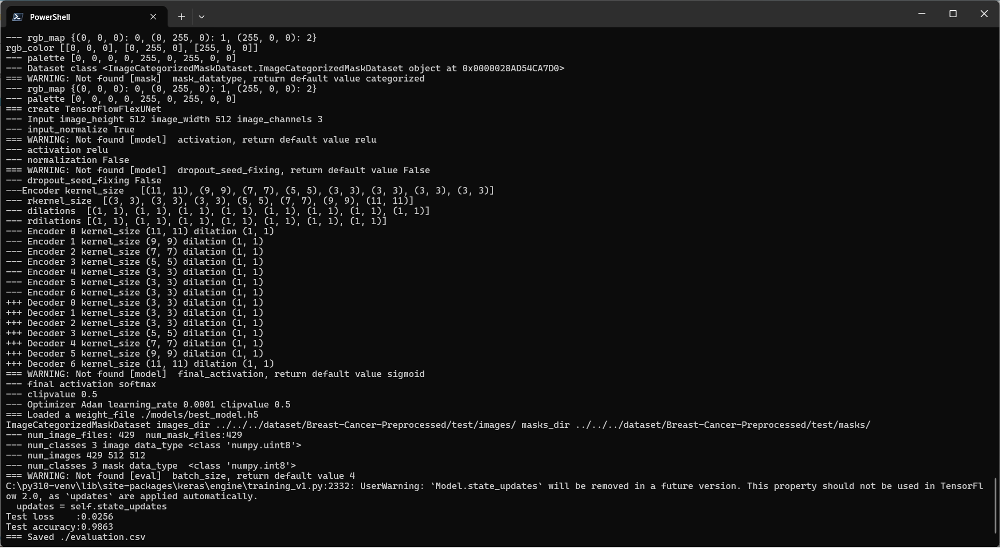
  Image-Segmentation-Breast-Cancer-Preprocessed
<a href="./projects/TensorFlowFlexUNet/Breast-Cancer-Preprocessed/evaluation.csv">evaluation.csv</a> 
The loss (categorical_crossentropy) to the tiledly split <b>Breast-Cancer-Preprocessed/test</b> was 
low, and dice_coef_multiclass high as shown below.
 
<pre>
categorical_crossentropy,0.0256
dice_coef_multiclass,0.9863
</pre>
 
<h3>5 Inference</h3>
Please move to a <b>./projects/TensorFlowFlexUNet/Breast-Cancer-Preprocessed</b> folder, and run the following bat file to infer segmentation regions for images by the Trained-TensorflowFlexUNet model for Breast-Cancer-Preprocessed. 
<pre>
>./3.infer.bat
</pre>
This simply runs the following command.
<pre>
>python ../../../src/TensorFlowFlexUNetInferencer.py ./train_eval_infer.config
</pre>

<b>mini_test_images</b> 
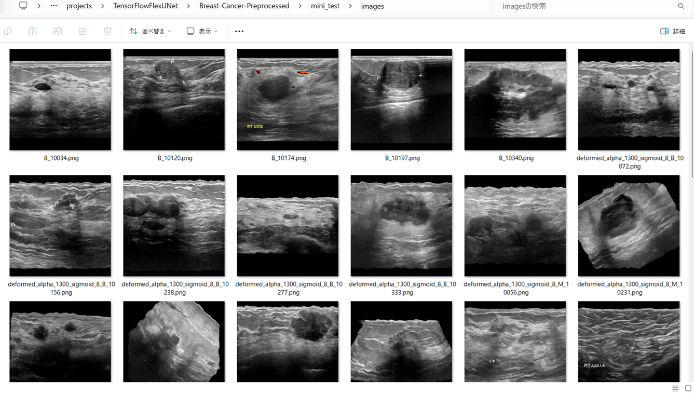 
<b>mini_test_mask(ground_truth)</b> 
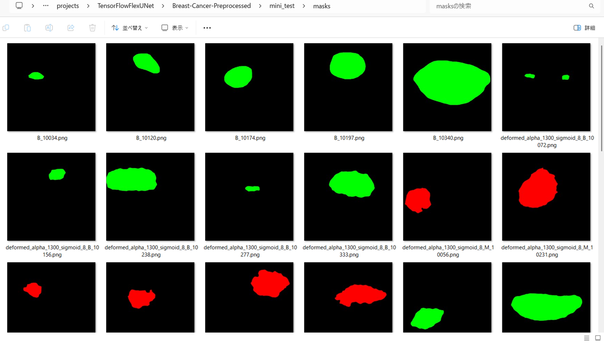 

<b>Inferred test masks</b> 
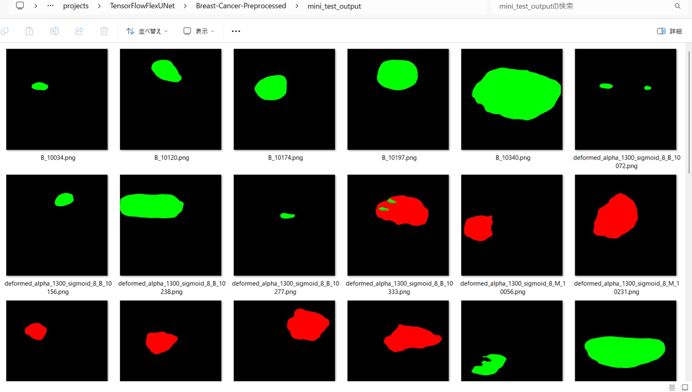 
 

<b>Enlarged images and masks for Breast-Cancer-Preprocessed of 512x512 pixels</b> 
As shown below, the inferred masks predicted by our segmentation model trained by the dataset appear similar to the ground truth masks.
 
 
<table>
<tr>
<th>Input: image</th>
<th>Mask (ground_truth)</th>
<th>Prediction: inferred_mask</th>
</tr>
<tr>
<td>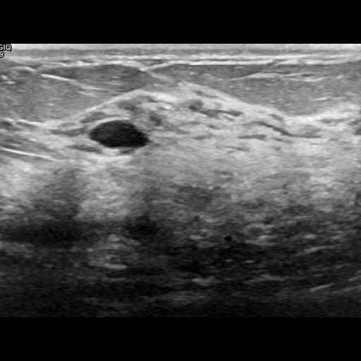</td>
<td></td>
<td></td>
</tr>

<tr>
<td>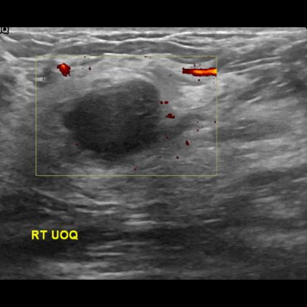</td>
<td></td>
<td></td>
</tr>
<tr>
<td>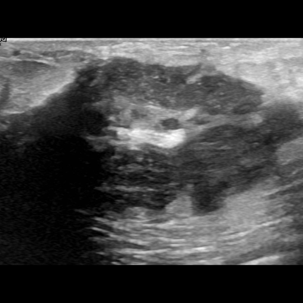</td>
<td>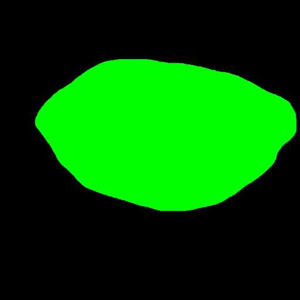</td>
<td>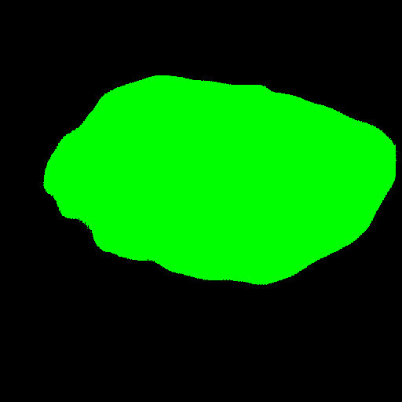</td>
</tr>
<tr>
<td></td>
<td></td>
<td></td>
</tr>
<tr>
<td>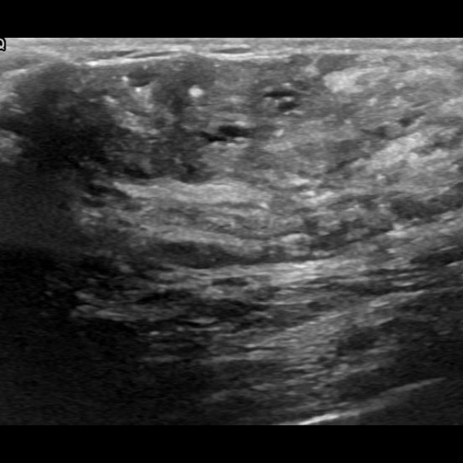</td>
<td></td>
<td>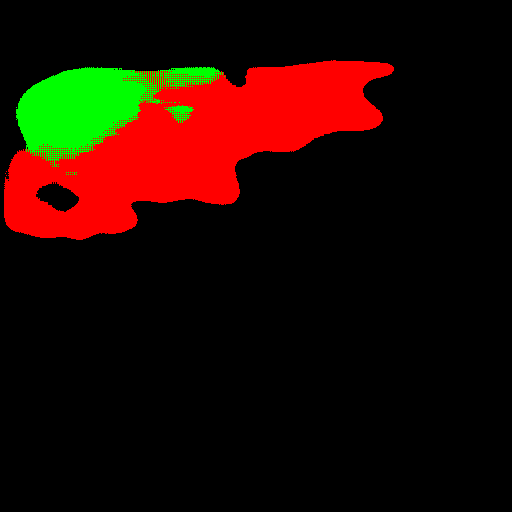</td>
</tr>
<tr>
<td></td>
<td></td>
<td></td>
</tr>

</table>

 
<h3>
References
</h3>
<b>1. Breast lesion detection using an anchor-free network from ultrasound images with segmentation-based enhancement</b> 
Yu Wang & Yudong Yao 
<a href="https://www.nature.com/articles/s41598-022-18747-y">
https://www.nature.com/articles/s41598-022-18747-y
</a>
 
 
<b>2. TensorFlow-FlexUNet-Image-Segmentation-BUSI-Breast-Cancer</b> 
Toshiyuki Arai  
<a href="https://github.com/sarah-antillia/TensorFlow-FlexUNet-Image-Segmentation-BUSI-Breast-Cancer">
https://github.com/sarah-antillia/TensorFlow-FlexUNet-Image-Segmentation-BUSI-Breast-Cancer
</a>
 
 
<b>3. TensorFlow-FlexUNet-Image-Segmentation-Combined-Breast-Cancer-Ultrasound</b> 
Toshiyuki Arai  
<a href="https://github.com/sarah-antillia/TensorFlow-FlexUNet-Image-Segmentation-Combined-Breast-Cancer-Ultrasound">
https://github.com/sarah-antillia/TensorFlow-FlexUNet-Image-Segmentation-Combined-Breast-Cancer-Ultrasound
</a>
 
 
<b>4. TensorFlow-FlexUNet-Image-Segmentation-BUS-BRA</b> 
Toshiyuki Arai  
<a href="https://github.com/sarah-antillia/TensorFlow-FlexUNet-Image-Segmentation-BUS-BRA">
https://github.com/sarah-antillia/TensorFlow-FlexUNet-Image-Segmentation-BUS-BRA
</a>
  
<b>5. TensorFlow-FlexUNet-Image-Segmentation-BUS-UC</b> 
Toshiyuki Arai @antillia.com 
<a href="https://github.com/sarah-antillia/TensorFlow-FlexUNet-Image-Segmentation-BUS-UC">
https://github.com/sarah-antillia/TensorFlow-FlexUNet-Image-Segmentation-BUS-UC</a>
 
 
<b>6. TensorFlow-FlexUNet-Image-Segmentation-Model</b> 
Toshiyuki Arai  
<a href="https://github.com/sarah-antillia/TensorFlow-FlexUNet-Image-Segmentation-Model">
https://github.com/sarah-antillia/TensorFlow-FlexUNet-Image-Segmentation-Model
</a>
 
 
